  
  
  

  

  
  
   
  
<b>Aspiring Top-Tier Backend Developer & Cloud Architect</b> Mastering algorithms, scalable system design, and AWS. Open for collaborations, hackathons, and dev roles!

  
   

  

    
    
  

  

  <h3> TECHNOLOGY STACK</h3>
   
  

 

  <h3> GITHUB ACTIVITY SUMMARY</h3>
   
  
  
    
  <!-- Animated contribution activity graph overlay -->
  

 

  <h3> CONTRIBUTION SNAKE</h3>
  <!-- 
  The snake animation is hidden until you run the GitHub Action (see instructions at bottom of file) 
  <picture>
    <source media="(prefers-color-scheme: dark)" srcset="https://raw.githubusercontent.com/Madhav1912/Madhav1912/output/github-contribution-grid-snake-dark.svg">
    <source media="(prefers-color-scheme: light)" srcset="https://raw.githubusercontent.com/Madhav1912/Madhav1912/output/github-contribution-grid-snake.svg">
    
  </picture>
  -->

  

  

<!--
=========================================
🟢 HOW TO ENABLE THE CONTRIBUTION SNAKE:
=========================================
1. Inside this repository, click on the "Actions" tab.
2. Click on "New workflow" -> "set up a workflow yourself".
3. Name it "snake.yml" and paste the following code:

name: Generate Snake
on:
  schedule:
    - cron: "* */12 * * *"
  workflow_dispatch:
jobs:
  build:
    name: Jobs to update datas
    runs-on: ubuntu-latest
    steps:
      - uses: Platane/snk@v3
        with:
          github_user_name: ${{ github.repository_owner }}
          outputs: |
            dist/github-contribution-grid-snake.svg
            dist/github-contribution-grid-snake-dark.svg?palette=github-dark
      - uses: crazy-max/ghaction-github-pages@v3.1.0
        with:
          target_branch: output
          build_dir: dist
        env:
          GITHUB_TOKEN: ${{ secrets.GITHUB_TOKEN }}
          
4. Commit the changes.
5. Go back to Actions, select "Generate Snake", and manually click "Run workflow".
6. The snake SVG will now render correctly in your README!
-->
